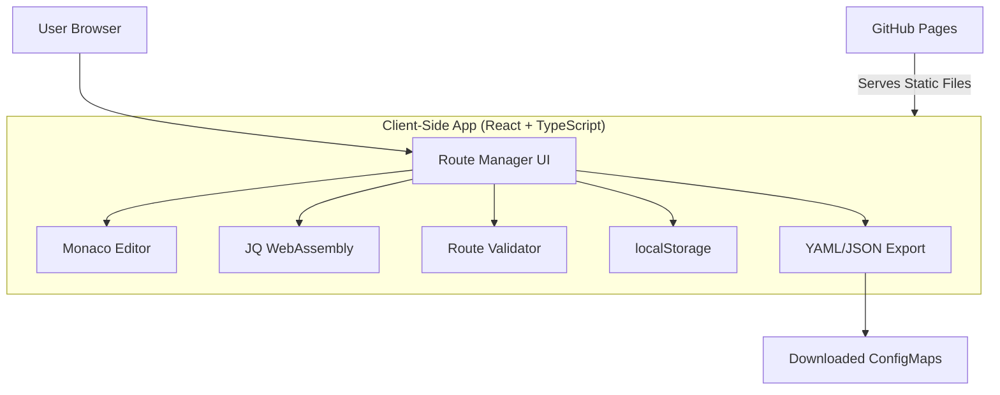

# Software Design Document (SDD)
## OpenHQM Router Manager

**Version:** 2.0  
**Date:** February 8, 2026  
**Status:** Client-Side Only - GitHub Pages

---

## 1. Executive Summary

OpenHQM Router Manager is a **pure client-side** web application for creating, testing, and managing OpenHQM routing rules. It runs entirely in the browser with no backend required. Users can visually design routes, test JQ transformations in real-time, simulate message routing, and export configurations as Kubernetes ConfigMaps.

**Deployment**: GitHub Pages static site - `https://yourusername.github.io/openhqm-rm/`

### 1.1 Purpose
Provide an easy-to-use, no-installation-required web tool for creating and testing OpenHQM route configurations. Users can access it instantly from any browser, create routes visually, test with sample data, and download YAML configurations for deployment.

### 1.2 Key Features
- **Zero Installation**: Access instantly via web browser, no setup required
- **Visual Route Editor**: Drag-and-drop interface for creating routing rules
- **JQ Transform Simulator**: Real-time payload transformation using JQ (WebAssembly)
- **Route Testing & Simulation**: Validate routing logic against test payloads
- **ConfigMap Export**: Download routes as Kubernetes ConfigMaps (YAML/JSON)
- **Local Storage**: Save work in progress in browser localStorage
- **Multi-Route Management**: Create and organize multiple route configurations
- **Offline Capable**: Works without internet connection after initial load

---

## 2. System Architecture

### 2.1 High-Level Architecture



### 2.2 Component Overview

**All processing happens in the browser - no server required.**

#### 2.2.1 Core Components
- **React Application**: Single-page application built with React 18+ and TypeScript
- **Monaco Editor**: VS Code-powered code editor for YAML/JSON and JQ expressions
- **JQ WebAssembly**: Client-side JQ execution via @jqlang/jq-web
- **Route Visualizer**: Visual drag-and-drop interface for building routes
- **Simulation Engine**: Client-side route matching and transformation testing
- **ConfigMap Manager**: Import/export Kubernetes ConfigMaps (YAML/JSON)
- **Local Storage**: Browser localStorage for persisting work between sessions
- **Export Engine**: Generate Kubernetes-ready ConfigMap files for download

---

## 3. Data Models

### 3.1 Route Configuration

```typescript
interface RouteConfig {
  metadata: RouteMetadata;
  spec: RouteSpec;
}

interface RouteMetadata {
  name: string;
  namespace: string;
  version: string;
  description?: string;
  labels?: Record<string, string>;
  annotations?: Record<string, string>;
  createdAt: string;
  updatedAt: string;
}

interface RouteSpec {
  routes: Route[];
  defaultRoute?: string;
  errorHandling?: ErrorHandlingConfig;
}

interface Route {
  id: string;
  name: string;
  description?: string;
  enabled: boolean;
  priority: number;
  
  // Matching conditions
  conditions: RouteCondition[];
  conditionOperator: 'AND' | 'OR';
  
  // Actions
  actions: RouteAction[];
  
  // Transformation
  transform?: TransformConfig;
  
  // Destination
  destination: DestinationConfig;
}

interface RouteCondition {
  type: 'header' | 'payload' | 'metadata' | 'jq';
  field?: string;
  operator: 'equals' | 'contains' | 'regex' | 'exists' | 'jq';
  value?: any;
  jqExpression?: string;
}

interface RouteAction {
  type: 'log' | 'tag' | 'header' | 'metadata' | 'metric';
  key?: string;
  value?: string;
  jqExpression?: string;
}

interface TransformConfig {
  enabled: boolean;
  jqExpression: string;
  errorHandling: 'fail' | 'skip' | 'default';
  defaultValue?: any;
}

interface DestinationConfig {
  type: 'endpoint' | 'queue' | 'webhook';
  target: string;
  
  // For endpoint type
  endpoint?: string;
  
  // For queue type
  queueName?: string;
  
  // For webhook type
  webhookUrl?: string;
  webhookMethod?: 'POST' | 'PUT' | 'PATCH';
  webhookHeaders?: Record<string, string>;
}

interface ErrorHandlingConfig {
  onValidationError: 'reject' | 'default' | 'fallback';
  onTransformError: 'reject' | 'skip' | 'original';
  defaultRoute?: string;
  fallbackRoute?: string;
}
```

### 3.2 Kubernetes ConfigMap Format

```yaml
apiVersion: v1
kind: ConfigMap
metadata:
  name: openhqm-routes
  namespace: openhqm
  labels:
    app: openhqm
    component: router
    version: "1.0"
data:
  routes.yaml: |
    version: "1.0"
    routes:
      - id: route-001
        name: "High Priority Orders"
        enabled: true
        priority: 100
        conditions:
          - type: payload
            field: order.priority
            operator: equals
            value: "high"
        transform:
          enabled: true
          jqExpression: |
            {
              orderId: .order.id,
              customerId: .customer.id,
              priority: "HIGH",
              items: [.order.items[] | {sku: .sku, qty: .quantity}]
            }
        destination:
          type: endpoint
          endpoint: "order-service-high"
```

### 3.3 Simulation Context

```typescript
interface SimulationContext {
  id: string;
  timestamp: string;
  
  // Input
  input: {
    payload: any;
    headers: Record<string, string>;
    metadata: Record<string, any>;
  };
  
  // Execution trace
  trace: SimulationStep[];
  
  // Output
  output: {
    matchedRoute?: string;
    transformedPayload?: any;
    destination?: string;
    actions: ExecutedAction[];
    errors: SimulationError[];
  };
  
  // Metrics
  metrics: {
    totalDuration: number;
    matchingDuration: number;
    transformDuration: number;
  };
}

interface SimulationStep {
  step: number;
  type: 'condition' | 'transform' | 'action' | 'route';
  description: string;
  input?: any;
  output?: any;
  duration: number;
  success: boolean;
  error?: string;
}

interface ExecutedAction {
  type: string;
  key: string;
  value: any;
  success: boolean;
}

interface SimulationError {
  severity: 'error' | 'warning';
  message: string;
  context?: string;
  suggestion?: string;
}
```

---

## 4. Frontend Design

### 4.1 Technology Stack

- **Framework**: React 18 with TypeScript
- **State Management**: Zustand or Redux Toolkit
- **UI Library**: Material-UI (MUI) or Ant Design
- **Code Editor**: Monaco Editor (VS Code editor)
- **JQ Integration**: @jqlang/jq-web (WebAssembly)
- **HTTP Client**: Axios
- **Form Validation**: Zod or Yup
- **Build Tool**: Vite
- **Testing**: Vitest + React Testing Library

### 4.2 UI Layout

```
┌─────────────────────────────────────────────────────────────┐
│  OpenHQM Router Manager                    [Save] [Deploy]  │
├───────────────┬─────────────────────────────────────────────┤
│               │                                             │
│  Route List   │  Route Editor                               │
│               │                                             │
│ ┌───────────┐ │  Name: [High Priority Orders          ]   │
│ │ Route 1 ✓ │ │  Priority: [100]  Status: [✓ Enabled ]   │
│ │ Route 2   │ │                                             │
│ │ Route 3   │ │  Conditions:                                │
│ │ + New     │ │  ┌─────────────────────────────────────┐   │
│ └───────────┘ │  │ Field: order.priority               │   │
│               │  │ Operator: equals                    │   │
│ Actions:      │  │ Value: "high"                       │   │
│ • Test Route  │  └─────────────────────────────────────┘   │
│ • Import CM   │                                             │
│ • Export CM   │  Transform (JQ):                            │
│               │  ┌─────────────────────────────────────┐   │
│               │  │ {                                   │   │
│               │  │   orderId: .order.id,               │   │
│               │  │   customerId: .customer.id          │   │
│               │  │ }                                   │   │
│               │  └─────────────────────────────────────┘   │
│               │                                             │
│               │  [Test Transform]  [Simulate Route]        │
├───────────────┴─────────────────────────────────────────────┤
│  Simulation Results                                         │
│  ┌─────────────────────────────────────────────────────┐   │
│  │ ✓ Route matched: route-001                         │   │
│  │ ✓ Transform successful (12ms)                       │   │
│  │ → Destination: order-service-high                   │   │
│  └─────────────────────────────────────────────────────┘   │
└─────────────────────────────────────────────────────────────┘
```

### 4.3 Key Views

#### 4.3.1 Route List View
- Display all configured routes
- Quick enable/disable toggle
- Drag-and-drop for priority reordering
- Filter and search capabilities
- Bulk operations (enable/disable/delete)

#### 4.3.2 Route Editor View
- **Basic Info**: Name, description, priority, enabled status
- **Conditions Section**: 
  - Add/remove conditions
  - Visual condition builder
  - Support for AND/OR operators
  - JQ expression editor for complex conditions
- **Transform Section**:
  - Monaco editor with JQ syntax highlighting
  - Live preview with sample data
  - Error highlighting and suggestions
- **Actions Section**:
  - Configure logging, tagging, headers
  - JQ-based dynamic values
- **Destination Section**:
  - Endpoint selector
  - Queue name input
  - Webhook configuration

#### 4.3.3 JQ Playground
- **Input Panel**: JSON editor for test payload
- **Transform Panel**: JQ expression editor
- **Output Panel**: Transformed result
- **Error Display**: Validation errors and suggestions
- **Examples Library**: Common JQ patterns
- **Syntax Help**: Inline documentation

#### 4.3.4 Simulation View
- **Test Input**: Define test payloads, headers, metadata
- **Execution Trace**: Step-by-step execution visualization
- **Result Display**: Final output and destination
- **Performance Metrics**: Timing breakdown
- **Error Analysis**: Detailed error information

#### 4.3.5 ConfigMap Manager
- **Import**: Upload ConfigMap YAML/JSON
- **Export**: Download current configuration as ConfigMap
- **Deploy**: Push to Kubernetes cluster
- **Diff View**: Compare current vs deployed versions
- **History**: View deployment history

### 4.4 Component Structure

```
src/
├── components/
│   ├── RouteList/
│   │   ├── RouteList.tsx
│   │   ├── RouteItem.tsx
│   │   └── RouteList.styles.ts
│   ├── RouteEditor/
│   │   ├── RouteEditor.tsx
│   │   ├── BasicInfo.tsx
│   │   ├── ConditionsEditor.tsx
│   │   ├── TransformEditor.tsx
│   │   ├── ActionsEditor.tsx
│   │   ├── DestinationEditor.tsx
│   │   └── RouteEditor.styles.ts
│   ├── JQPlayground/
│   │   ├── JQPlayground.tsx
│   │   ├── InputPanel.tsx
│   │   ├── TransformPanel.tsx
│   │   ├── OutputPanel.tsx
│   │   └── ExamplesLibrary.tsx
│   ├── Simulator/
│   │   ├── Simulator.tsx
│   │   ├── TestInputEditor.tsx
│   │   ├── ExecutionTrace.tsx
│   │   ├── ResultDisplay.tsx
│   │   └── Simulator.styles.ts
│   ├── ConfigMapManager/
│   │   ├── ConfigMapManager.tsx
│   │   ├── ImportDialog.tsx
│   │   ├── ExportDialog.tsx
│   │   ├── DeployDialog.tsx
│   │   └── DiffViewer.tsx
│   └── common/
│       ├── CodeEditor.tsx
│       ├── JSONViewer.tsx
│       ├── ErrorDisplay.tsx
│       └── LoadingSpinner.tsx
├── hooks/
│   ├── useRoutes.ts
│   ├── useJQTransform.ts
│   ├── useSimulation.ts
│   └── useConfigMap.ts
├── services/
│   ├── api.ts
│   ├── jqEngine.ts
│   ├── routeValidator.ts
│   └── kubeClient.ts
├── store/
│   ├── routesSlice.ts
│   ├── simulationSlice.ts
│   └── uiSlice.ts
├── types/
│   ├── route.ts
│   ├── simulation.ts
│   └── configmap.ts
├── utils/
│   ├── jqHelpers.ts
│   ├── yamlParser.ts
│   └── validators.ts
├── App.tsx
└── main.tsx
```

---

## 5. Client-Side Services

### 5.1 JQ Service (WebAssembly)

```typescript
import jq from '@jqlang/jq-web';

export class JQService {
  private jq: any;
  
  async init() {
    // Initialize JQ WebAssembly module
    this.jq = await jq();
  }
  
  async transform(expression: string, inputData: any): Promise<{
    success: boolean;
    output?: any;
    error?: string;
  }> {
    try {
      const result = await this.jq.json(inputData, expression);
      return { success: true, output: result };
    } catch (error) {
      return {
        success: false,
        error: this.parseJQError(error)
      };
    }
  }
  
  async validate(expression: string): Promise<{
    valid: boolean;
    error?: string;
    suggestions?: string[];
  }> {
    try {
      // Test with empty object
      await this.jq.json({}, expression);
      return { valid: true };
    } catch (error) {
      return {
        valid: false,
        error: this.parseJQError(error),
        suggestions: this.getSuggestions(error)
      };
    }
  }
  
  private parseJQError(error: any): string {
    const message = error.message || error.toString();
    return message.replace(/jq: error:?/gi, '').trim();
  }
  
  private getSuggestions(error: any): string[] {
    const suggestions: string[] = [];
    const message = (error.message || '').toLowerCase();
    
    if (message.includes('undefined') || message.includes('null')) {
      suggestions.push('Check if all field paths exist in your input data');
      suggestions.push('Use the // operator for default values: .field // "default"');
    }
    
    if (message.includes('syntax') || message.includes('parse')) {
      suggestions.push('Verify JQ syntax - common issues: missing pipes |, parentheses, or brackets');
      suggestions.push('Check for unmatched quotes or brackets');
    }
    
    if (message.includes('cannot iterate')) {
      suggestions.push('Make sure you are iterating over an array or object');
      suggestions.push('Use [] to iterate: .items[]');
    }
    
    return suggestions;
  }
}
```

### 5.2 Route Matcher (Client-Side)

```typescript
import { JQService } from './jqService';

export class RouteMatcher {
  constructor(private jqService: JQService) {}
  
  async matchRoute(
    routes: Route[],
    context: SimulationContext
  ): Promise<Route | null> {
    // Sort by priority (higher first)
    const sortedRoutes = routes
      .filter(r => r.enabled)
      .sort((a, b) => b.priority - a.priority);
    
    for (const route of sortedRoutes) {
      if (await this.evaluateConditions(route, context)) {
        return route;
      }
    }
    
    return null;
  }
  
  private async evaluateConditions(
    route: Route,
    context: SimulationContext
  ): Promise<boolean> {
    const results = await Promise.all(
      route.conditions.map(c => this.evaluateCondition(c, context))
    );
    
    if (route.conditionOperator === 'AND') {
      return results.every(r => r);
    } else {
      return results.some(r => r);
    }
  }
  
  private async evaluateCondition(
    condition: RouteCondition,
    context: SimulationContext
  ): Promise<boolean> {
    switch (condition.type) {
      case 'jq':
        return this.evaluateJQCondition(condition, context);
      case 'payload':
        return this.evaluatePayloadCondition(condition, context);
      case 'header':
        return this.evaluateHeaderCondition(condition, context);
      case 'metadata':
        return this.evaluateMetadataCondition(condition, context);
      default:
        return false;
    }
  }
  
  private async evaluateJQCondition(
    condition: RouteCondition,
    context: SimulationContext
  ): Promise<boolean> {
    try {
      const result = await this.jqService.transform(
        condition.jqExpression!,
        context.input.payload
      );
      return result.success && Boolean(result.output);
    } catch (error) {
      console.error('JQ condition evaluation error:', error);
      return false;
    }
  }
  
  private evaluatePayloadCondition(
    condition: RouteCondition,
    context: SimulationContext
  ): boolean {
    const value = this.getNestedValue(context.input.payload, condition.field!);
    return this.compareValues(value, condition.operator, condition.value);
  }
  
  private getNestedValue(obj: any, path: string): any {
    return path.split('.').reduce((current, key) => current?.[key], obj);
  }
  
  private compareValues(actual: any, operator: string, expected: any): boolean {
    switch (operator) {
      case 'equals': return actual === expected;
      case 'contains': return String(actual).includes(String(expected));
      case 'regex': return new RegExp(expected).test(String(actual));
      case 'exists': return actual !== undefined && actual !== null;
      default: return false;
    }
  }
}
```

### 5.3 Local Storage Service

```typescript
export class StorageService {
  private readonly ROUTES_KEY = 'openhqm_routes';
  private readonly CONFIG_KEY = 'openhqm_config';
  
  saveRoutes(routes: RouteConfig[]): void {
    try {
      localStorage.setItem(this.ROUTES_KEY, JSON.stringify(routes));
    } catch (error) {
      console.error('Failed to save routes:', error);
    }
  }
  
  loadRoutes(): RouteConfig[] {
    try {
      const data = localStorage.getItem(this.ROUTES_KEY);
      return data ? JSON.parse(data) : [];
    } catch (error) {
      console.error('Failed to load routes:', error);
      return [];
    }
  }
  
  clearRoutes(): void {
    localStorage.removeItem(this.ROUTES_KEY);
  }
  
  exportToFile(routes: RouteConfig[], filename: string = 'routes.yaml'): void {
    const yaml = this.generateConfigMap(routes);
    const blob = new Blob([yaml], { type: 'text/yaml' });
    const url = URL.createObjectURL(blob);
    const a = document.createElement('a');
    a.href = url;
    a.download = filename;
    a.click();
    URL.revokeObjectURL(url);
  }
  
  private generateConfigMap(routes: RouteConfig[]): string {
    // Generate Kubernetes ConfigMap YAML
    return `apiVersion: v1
kind: ConfigMap
metadata:
  name: openhqm-routes
  namespace: openhqm
  labels:
    app: openhqm
    component: router
data:
  routes.yaml: |
    version: "1.0"
    routes:
${routes.map(r => this.routeToYaml(r, 6)).join('\n')}`;
  }
  
  private routeToYaml(route: Route, indent: number): string {
    // Convert route object to YAML string
    // Implementation details...
  }
}
```

---

## 6. Detailed Features

### 6.1 Route Condition Builder

Visual builder for creating routing conditions without writing code:

```typescript
// Example: Visual condition builder output
{
  conditions: [
    {
      type: 'payload',
      field: 'order.priority',
      operator: 'equals',
      value: 'high'
    },
    {
      type: 'header',
      field: 'X-Customer-Type',
      operator: 'contains',
      value: 'premium'
    },
    {
      type: 'jq',
      jqExpression: '.order.total > 1000'
    }
  ],
  conditionOperator: 'AND'
}
```

**UI Features**:
- Drag-and-drop condition ordering
- Type-ahead for field names
- Operator dropdown (equals, contains, regex, exists, gt, lt, etc.)
- Value input with type validation
- Toggle between visual builder and JQ expression mode

### 6.2 JQ Transform Editor

Monaco-based editor with JQ syntax support:

**Features**:
- Syntax highlighting for JQ expressions
- Auto-completion for JQ functions
- Inline error highlighting
- Live preview with sample data
- Function reference sidebar
- Common pattern templates

**Example Templates**:
```jq
# Extract fields
{
  id: .id,
  name: .name,
  timestamp: now
}

# Filter array
.items | map(select(.active == true))

# Flatten nested structure
.orders[].items[] | {orderId: .orderId, sku: .sku}

# Conditional logic
if .priority == "high" then .sla = 1 else .sla = 24 end

# Error handling with defaults
{
  id: .id,
  name: .name // "Unknown",
  email: .contact.email // .contact.phone // "N/A"
}
```

### 6.3 Route Simulation Engine

Simulate complete message routing with detailed tracing:

```typescript
// Simulation execution
const simulation: SimulationContext = {
  id: 'sim-123',
  timestamp: '2026-02-08T10:00:00Z',
  input: {
    payload: { order: { id: 1, priority: 'high' } },
    headers: { 'Content-Type': 'application/json' },
    metadata: { source: 'web' }
  },
  trace: [
    {
      step: 1,
      type: 'condition',
      description: 'Evaluating condition: order.priority == "high"',
      input: { order: { id: 1, priority: 'high' } },
      output: true,
      duration: 2,
      success: true
    },
    {
      step: 2,
      type: 'transform',
      description: 'Applying JQ transform',
      input: { order: { id: 1, priority: 'high' } },
      output: { orderId: 1, priority: 'HIGH' },
      duration: 5,
      success: true
    },
    {
      step: 3,
      type: 'route',
      description: 'Routing to endpoint: order-service-high',
      output: { endpoint: 'order-service-high' },
      duration: 1,
      success: true
    }
  ],
  output: {
    matchedRoute: 'route-001',
    transformedPayload: { orderId: 1, priority: 'HIGH' },
    destination: 'order-service-high',
    actions: [
      { type: 'log', key: 'level', value: 'info', success: true }
    ],
    errors: []
  },
  metrics: {
    totalDuration: 8,
    matchingDuration: 2,
    transformDuration: 5
  }
};
```

### 6.4 ConfigMap Export/Import

#### Export Format

```yaml
apiVersion: v1
kind: ConfigMap
metadata:
  name: openhqm-routes
  namespace: openhqm
  labels:
    app: openhqm
    component: router
    version: "1.0.0"
    managedBy: router-manager
  annotations:
    description: "OpenHQM routing configuration"
    lastModified: "2026-02-08T10:00:00Z"
    modifiedBy: "user@example.com"
data:
  routes.yaml: |
    version: "1.0"
    routes:
      - id: route-001
        name: "High Priority Orders"
        description: "Route high-priority orders to dedicated service"
        enabled: true
        priority: 100
        conditions:
          - type: payload
            field: order.priority
            operator: equals
            value: "high"
        transform:
          enabled: true
          jqExpression: |
            {
              orderId: .order.id,
              customerId: .customer.id,
              priority: "HIGH",
              items: [.order.items[] | {sku: .sku, qty: .quantity}],
              timestamp: now
            }
          errorHandling: fail
        actions:
          - type: log
            key: level
            value: info
          - type: tag
            key: priority
            value: high
        destination:
          type: endpoint
          endpoint: order-service-high
```

#### Import Validation

When importing a ConfigMap:
1. Validate YAML/JSON syntax
2. Validate route schema
3. Check for duplicate route IDs
4. Validate JQ expressions
5. Check for condition conflicts
6. Verify endpoint references

### 6.5 Route Validation

**Validation Rules**:
- Route IDs must be unique
- Priority must be non-negative integer
- JQ expressions must be syntactically valid
- Required fields must be present
- Destination endpoints must be configured in OpenHQM
- No circular route dependencies
- Condition operators must be valid for field types

**Conflict Detection**:
- Overlapping conditions (e.g., two routes matching same criteria)
- Priority conflicts (same priority with overlapping conditions)
- Unreachable routes (lower priority but more specific conditions)

### 6.6 Test Case Management

Save and manage test cases for routes:

```typescript
interface TestCase {
  id: string;
  name: string;
  description: string;
  routeId?: string;  // Test specific route or all routes
  input: {
    payload: any;
    headers: Record<string, string>;
    metadata: Record<string, any>;
  };
  expectedOutput?: {
    routeId: string;
    transformedPayload?: any;
    destination?: string;
  };
  createdAt: string;
}
```

**Features**:
- Save test cases with routes
- Run individual test or all tests
- Compare expected vs actual results
- Generate test cases from real traffic (future)
- Export test suites

---

## 7. Configuration

### 7.1 Build Configuration

```typescript
// vite.config.ts
import { defineConfig } from 'vite';
import react from '@vitejs/plugin-react';

export default defineConfig({
  plugins: [react()],
  base: '/openhqm-router-manager/',  // GitHub Pages base path
  build: {
    outDir: 'dist',
    sourcemap: true
  },
  optimizeDeps: {
    exclude: ['@jqlang/jq-web']  // JQ WebAssembly module
  }
});
```

### 7.2 Application Settings

```typescript
// src/config/settings.ts
export const settings = {
  app: {
    name: 'OpenHQM Router Manager',
    version: '2.0.0',
    repository: 'https://github.com/yourusername/openhqm-router-manager'
  },
  
  storage: {
    localStorageKey: 'openhqm_routes',
    autoSaveInterval: 30000,  // 30 seconds
    maxRoutes: 100
  },
  
  jq: {
    maxExecutionTime: 5000,  // milliseconds
    defaultExamples: [
      { name: 'Extract fields', expression: '{ id: .id, name: .name }' },
      { name: 'Filter array', expression: '[.items[] | select(.active == true)]' },
      // ... more examples
    ]
  },
  
  validation: {
    maxConditions: 20,
    maxRouteNameLength: 100,
    minPriority: 0,
    maxPriority: 1000
  },
  
  export: {
    defaultNamespace: 'openhqm',
    defaultConfigMapName: 'openhqm-routes',
    includeTimestamp: true
  }
};
```

---

## 8. Deployment

### 8.1 GitHub Pages Deployment

For GitHub Pages, no Docker needed. Build and deploy static files:

```bash
# Build frontend for production
cd frontend
npm run build

# Deploy to GitHub Pages
# Output goes to dist/ directory
# Configure GitHub Pages to serve from /docs or gh-pages branch
```

**GitHub Actions Workflow**:
```yaml
name: Deploy to GitHub Pages

on:
  push:
    branches: [main]

jobs:
  deploy:
    runs-on: ubuntu-latest
    steps:
      - uses: actions/checkout@v3
      - uses: actions/setup-node@v3
        with:
          node-version: '20'
      - name: Build
        run: |
          cd frontend
          npm ci
          npm run build
      - name: Deploy to GitHub Pages
        uses: peaceiris/actions-gh-pages@v3
        with:
          github_token: ${{ secrets.GITHUB_TOKEN }}
          publish_dir: ./dist
```

### 8.2 Local Development

```bash
# Install dependencies
npm install

# Run development server
npm run dev
# Access at http://localhost:5173

# Build for production
npm run build

# Preview production build
npm run preview
```

### 8.3 Custom Domain (Optional)

To use a custom domain with GitHub Pages:

1. Add `CNAME` file to `public/` directory:
```
router-manager.yourdomain.com
```

2. Configure DNS:
```
CNAME record: router-manager -> yourusername.github.io
```

3. Enable HTTPS in repository settings

---

## 9. Security

### 9.1 Client-Side Security

**Security Considerations**:
- **All processing in browser**: No data sent to external servers
- **LocalStorage**: Data persists only in user's browser
- **HTTPS**: GitHub Pages serves over HTTPS automatically
- **CSP Headers**: Content Security Policy configured
- **Input Validation**: Validate all user inputs before processing
- **JQ Execution Limits**: Timeout long-running JQ expressions

### 9.2 Best Practices

1. **Input Sanitization**: Validate all route configurations before saving
2. **JQ Sandboxing**: Set execution timeout (5 seconds default)
3. **XSS Prevention**: Monaco editor handles code safely
4. **Data Privacy**: All data stays in user's browser
5. **Export Safety**: Validate YAML/JSON before download
6. **Browser Limits**: Handle localStorage quota exceeded gracefully

### 9.3 Privacy

**No Data Collection**:
- No analytics or tracking
- No external API calls (except CDN for libraries)
- No cookies
- No server-side storage
- Routes never leave the user's browser unless explicitly exported

---

## 10. Testing Strategy

### 10.1 Frontend Testing

```typescript
// Example: Route editor test
describe('RouteEditor', () => {
  it('should create a new route with conditions', () => {
    render(<RouteEditor />);
    
    // Fill in basic info
    fireEvent.change(screen.getByLabelText('Route Name'), {
      target: { value: 'Test Route' }
    });
    
    // Add condition
    fireEvent.click(screen.getByText('Add Condition'));
    fireEvent.change(screen.getByLabelText('Field'), {
      target: { value: 'order.priority' }
    });
    
    // Save
    fireEvent.click(screen.getByText('Save'));
    
    expect(mockSaveRoute).toHaveBeenCalledWith(
      expect.objectContaining({
        name: 'Test Route',
        conditions: expect.arrayContaining([
          expect.objectContaining({ field: 'order.priority' })
        ])
      })
    );
  });
});
```

### 10.2 Service Testing

```typescript
// Example: JQ transform test
describe('JQService', () => {
  it('should transform payload using JQ expression', async () => {
    const jqService = new JQService();
    await jqService.init();
    
    const input = { order: { id: 123, items: [1, 2, 3] } };
    const expression = '{ orderId: .order.id, itemCount: (.order.items | length) }';
    
    const result = await jqService.transform(expression, input);
    
    expect(result.success).toBe(true);
    expect(result.output).toEqual({
      orderId: 123,
      itemCount: 3
    });
  });
});
```

### 10.3 E2E Testing

```typescript
// Example: Full workflow test
describe('Route Management E2E', () => {
  it('should create, test, and export a route', async () => {
    // Navigate to app
    await page.goto('http://localhost:5173');
    
    // Create new route
    await page.click('[data-testid="new-route"]');
    await page.fill('[data-testid="route-name"]', 'E2E Test Route');
    
    // Add JQ transform
    await page.fill('[data-testid="jq-expression"]', '{ id: .id }');
    
    // Test transform
    await page.click('[data-testid="test-transform"]');
    await expect(page.locator('[data-testid="transform-result"]')).toBeVisible();
    
    // Save route
    await page.click('[data-testid="save-route"]');
    await expect(page.locator('[data-testid="success-message"]')).toBeVisible();
    
    // Export ConfigMap
    await page.click('[data-testid="export"]');
    const downloadPromise = page.waitForEvent('download');
    await page.click('[data-testid="export-yaml"]');
    const download = await downloadPromise;
    expect(download.suggestedFilename()).toBe('openhqm-routes.yaml');
  });
});
```

---

## 11. Observability

### 11.1 Performance Monitoring

**Client-Side Metrics** (logged to console):
- Page load times
- JQ transform execution times
- Simulation performance
- localStorage operations
- Component render times

```typescript
// Performance tracking
const trackPerformance = (operation: string, fn: () => void) => {
  const start = performance.now();
  fn();
  const duration = performance.now() - start;
  console.log(`${operation}: ${duration.toFixed(2)}ms`);
};
```

### 11.2 Error Handling

```typescript
// Global error boundary
class ErrorBoundary extends React.Component {
  componentDidCatch(error: Error, errorInfo: React.ErrorInfo) {
    console.error('Application error:', error, errorInfo);
    // Show user-friendly error message
    this.setState({ hasError: true, error });
  }
}

// JQ error handling
try {
  const result = await jqService.transform(expression, input);
  if (!result.success) {
    showError('JQ Transform Failed', result.error, result.suggestions);
  }
} catch (error) {
  showError('Unexpected Error', error.message);
}
```

### 11.3 Debug Mode

```typescript
// Enable debug mode via URL parameter
const isDebugMode = new URLSearchParams(window.location.search).get('debug') === 'true';

if (isDebugMode) {
  // Verbose logging
  console.log('Route created:', route);
  console.log('Simulation trace:', trace);
  // Performance markers
  performance.mark('route-simulation-start');
}
```

---

## 12. Future Enhancements

### 12.1 Phase 2 Features

1. **Git Integration**: Version control for route configurations
2. **Diff Viewer**: Compare route versions
3. **Route Templates**: Pre-built templates for common patterns
4. **Traffic Analysis**: View real traffic and suggest routes
5. **A/B Testing**: Test multiple route versions
6. **Route Performance**: Monitor route execution metrics
7. **Collaborative Editing**: Real-time collaboration
8. **Import from OpenAPI**: Generate routes from API specs

### 12.2 Phase 3 Features

1. **AI-Assisted Route Creation**: LLM-powered route suggestions
2. **Auto-optimization**: Analyze and optimize route performance
3. **Multi-cluster Support**: Manage routes across clusters
4. **Route Marketplace**: Share and discover route templates
5. **Advanced Visualizations**: Flow diagrams, dependency graphs
6. **Integration Testing**: Test against live OpenHQM instances
7. **Backup & Restore**: Route configuration backups
8. **Access Control**: Fine-grained permissions

---

## 13. Development Guidelines

### 13.1 Code Standards

**TypeScript**:
- Strict mode enabled
- No `any` types without justification
- Comprehensive type coverage

**React**:
- Functional components only
- Custom hooks for reusable logic
- Proper error boundaries

**Testing**:
- Minimum 80% code coverage
- Unit tests for all services
- Integration tests for APIs
- E2E tests for critical flows

### 13.2 Git Workflow

```
main
├── develop
│   ├── feature/route-editor
│   ├── feature/jq-playground
│   └── feature/k8s-integration
└── hotfix/security-patch
```

**Branch Naming**:
- `feature/description` - New features
- `bugfix/description` - Bug fixes
- `hotfix/description` - Critical fixes
- `docs/description` - Documentation

**Commit Messages**:
```
<type>(<scope>): <description>

[optional body]

[optional footer]
```

Types: `feat`, `fix`, `docs`, `style`, `refactor`, `test`, `chore`

### 13.3 Code Review Checklist

- [ ] Code follows style guidelines
- [ ] Tests added/updated
- [ ] Documentation updated
- [ ] No security vulnerabilities
- [ ] Performance considerations addressed
- [ ] Error handling implemented
- [ ] Logging added for key operations
- [ ] No console.log statements in production code

---

## 14. Documentation

### 14.1 User Documentation

- **Getting Started Guide**: Installation and first route
- **Route Configuration Guide**: Comprehensive routing documentation
- **JQ Reference**: JQ expression examples and patterns
- **API Documentation**: Complete API reference
- **Troubleshooting**: Common issues and solutions

### 14.2 Developer Documentation

- **Architecture Overview**: System design and components
- **API Reference**: Backend API documentation (OpenAPI/Swagger)
- **Component Documentation**: Frontend component library (Storybook)
- **Deployment Guide**: Deployment instructions
- **Contributing Guide**: How to contribute

---

## 15. Appendix

### 15.1 JQ Common Patterns

```jq
# Extract specific fields
{ id: .id, name: .name }

# Map array
[.items[] | { id: .id, name: .name }]

# Filter array
[.items[] | select(.active == true)]

# Conditional
if .type == "premium" then .discount = 0.2 else .discount = 0.1 end

# Default values
.email // .phone // "N/A"

# Nested access with safety
.user?.profile?.email // "no-email"

# Array operations
.items | length
.items | sort_by(.priority)
.items | group_by(.category)

# Date operations
now | strftime("%Y-%m-%d")

# String operations
.name | ascii_upcase
.description | split(" ") | join("-")

# Math operations
.price * 1.1
(.items | map(.price) | add) / (.items | length)
```

### 15.2 Example Route Configurations

See `examples/routes/` directory for complete examples:
- `high-priority-orders.yaml` - Priority-based routing
- `customer-segmentation.yaml` - Route by customer type
- `data-enrichment.yaml` - Transform and enrich payloads
- `error-handling.yaml` - Error routing patterns
- `multi-destination.yaml` - Fan-out routing

### 15.3 Glossary

- **Route**: A configuration rule that matches messages and defines processing
- **Condition**: A rule that determines if a route matches
- **Transform**: JQ expression that modifies message payload
- **Destination**: Target endpoint/queue for matched messages
- **ConfigMap**: Kubernetes resource for configuration data
- **JQ**: JSON query language for transformations
- **Simulation**: Test execution of routes with sample data

### 15.4 References

**Frontend Technologies**:
- **React**: https://react.dev/
- **TypeScript**: https://www.typescriptlang.org/
- **Vite**: https://vitejs.dev/
- **Monaco Editor**: https://microsoft.github.io/monaco-editor/
- **Material-UI**: https://mui.com/ or **Ant Design**: https://ant.design/
- **Zustand**: https://github.com/pmndrs/zustand
- **Zod**: https://zod.dev/

**JQ Integration**:
- **jq-web (WebAssembly)**: https://github.com/jqlang/jq-web
- **JQ Manual**: https://stedolan.github.io/jq/manual/
- **JQ Tutorial**: https://stedolan.github.io/jq/tutorial/

**Kubernetes**:
- **ConfigMaps**: https://kubernetes.io/docs/concepts/configuration/configmap/
- **Labels and Selectors**: https://kubernetes.io/docs/concepts/overview/working-with-objects/labels/

**Deployment**:
- **GitHub Pages**: https://pages.github.com/
- **GitHub Actions**: https://docs.github.com/en/actions

### 15.5 Change Log

- **2026-02-08**: Initial SDD version 1.0
- **2026-02-08**: Version 2.0 - Simplified to client-side only GitHub Pages application, removed all backend/server components

---

**End of Document**

